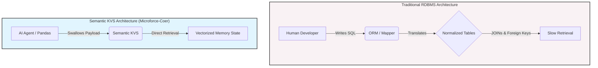
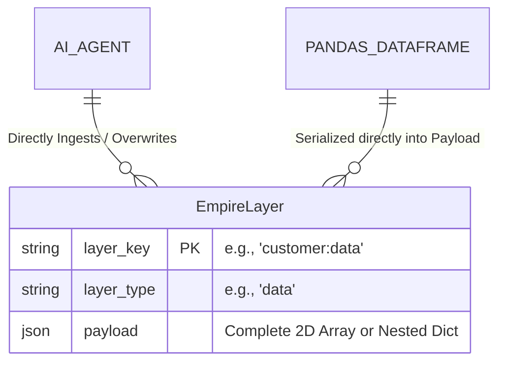
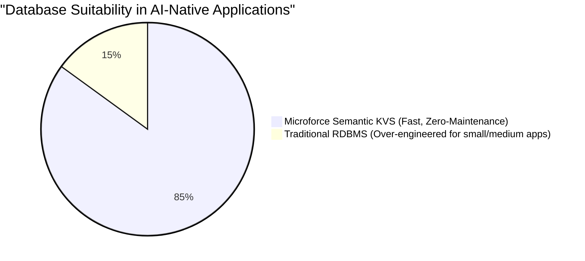

# Bypassing the RDBMS Bottleneck: A Semantic Key-Value Store Architecture for AI-Native Application Development

**Author:** Gen Nishizumi
**Project:** Microforce-Coer (V3)
**License:** Apache 2.0

---

## Abstract
For decades, Relational Database Management Systems (RDBMS) have dictated the architecture of software applications. The normalization of data into tabular schemas was driven by a fundamental constraint: human developers needed to visually comprehend data structures and write SQL to establish relationships. However, with the advent of Large Language Models (LLMs) serving as autonomous execution engines, this human-centric constraint has transformed into a critical bottleneck. This paper proposes the "Mille-feuille Architecture"—a multi-dimensional, Semantic Key-Value Store (KVS) that abandons SQL normalization in favor of vectorized, AI-native payload ingestion.

---

## 1. The RDBMS Bottleneck in the AI Era

従来のシステム開発において、RDBMS（リレーショナルデータベース）は不可欠な存在でした。データを第三正規形まで分解し、外部キー制約を設け、ORM（Object-Relational Mapping）を通じてPythonやGoなどのアプリケーション言語にマッピングする。この「正規化」というプロセスは、**「人間の低い認知能力に合わせて、データを分かりやすく整理する」**ための必然的な儀式でした。

しかし、AIが直接システムを自律駆動する「AIネイティブ時代」において、この人間中心のアーキテクチャは致命的なオーバーヘッドを生み出します。

AIは、細切れにされたテーブルをSQLで組み立て直す処理を必要としません。AIにとって最も効率的なのは、必要なコンテキスト（スキーマ、データ、UI制約など）が**「多次元配列（JSONやVector）」としてひとまとめになった層（レイヤー）**を、直接メモリ上に展開することです。

---

## 2. The Mille-feuille Architecture (ミルフィーユ・アーキテクチャ)

我々が提唱する「Semantic KVS」は、RDBの複雑なテーブル群を捨て去り、単一の巨大なKVS（Key-Value Store）テーブルへと純化させた設計です。これを我々は **「ミルフィーユ・アーキテクチャ」** と呼称します。

### 2.1 Core Schema Design
ストレージエンジン（SQLite）上には、実質的に以下の3つのカラムしか存在しません。

1. **`layer_key` (Primary Key):** データの集合体を一意に特定するID（例: `catalog:summer_2026`）。
2. **`layer_type` (Index):** この層が何を示すか（例: `schema`, `data`, `ui_rules`）。
3. **`payload` (JSON):** 実際のデータ本体。Pandasの二次元データフレームや、複雑にネストされたJSON構造をそのまま丸呑みする。

### 2.2 Paradigm Shift in Data Handling
このアーキテクチャにより、以下の革命的な変化が起こります。

- **マイグレーションの消滅:** データ構造（カラム）の変更は、ただJSONのプロパティを増やすだけで完了します。`ALTER TABLE` や Alembic などのスキーマ管理ツールは完全に不要になります。
- **ORMの迂回 (Bypassing ORM):** 行（Row）ごとのオブジェクト・マッピングを廃止し、巨大なJSONペイロードをPydanticやPandas DataFrameに一撃で流し込む「ベクター志向」の処理へと移行します。

---

## 3. Disruption of the SME and SaaS Market

もちろん、数千台のサーバーでペタバイト級の分散トランザクションを行う巨大金融機関から、PostgreSQLやOracleが即座に消え去るわけではありません。

しかし、世界のアプリケーションの90%以上を占める **「中小企業の業務システム」「SaaSのバックエンド」「社内管理ツール（Kintone領域）」** においては、Semantic KVSが圧倒的な最適解となります。

これらの市場において、従来型のRDBMSは「過剰な設計（Over-engineered）」であり、インフラの保守コストを無駄に押し上げていました。Microforce-Coerが提供する「AIによる保守フリー」「ローカル完結」「超高速なKVSシリアライズ」は、この巨大なミドルマーケットを完全に置き換える破壊的イノベーションとなります。

---

## 4. Conclusion

「データベースの正規化」は、もはや過去の遺物です。
これからのAI時代において、真に求められるのは「人間の目に見やすいテーブル」ではなく、「実行エンジン（AI）が最速で処理できるセマンティックな層の積み重ね」です。
Microforce-Coerは、RDBMSという過去の鎖を断ち切り、ソフトウェア開発を次なる次元へと引き上げる先駆的なインフラストラクチャです。
