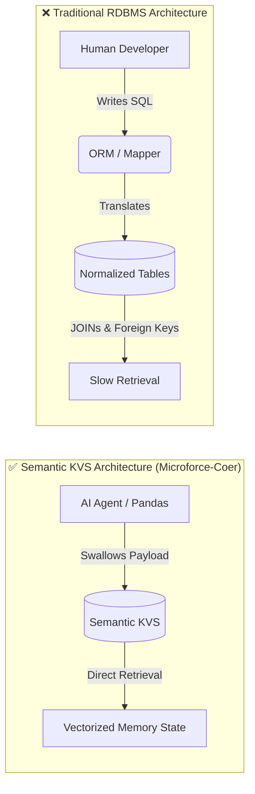
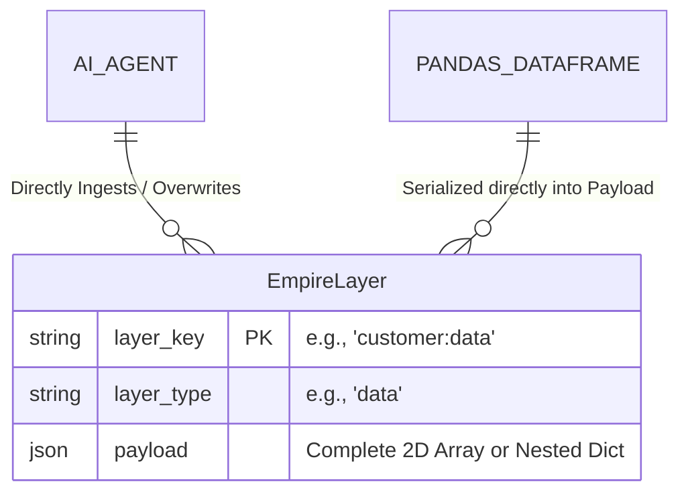
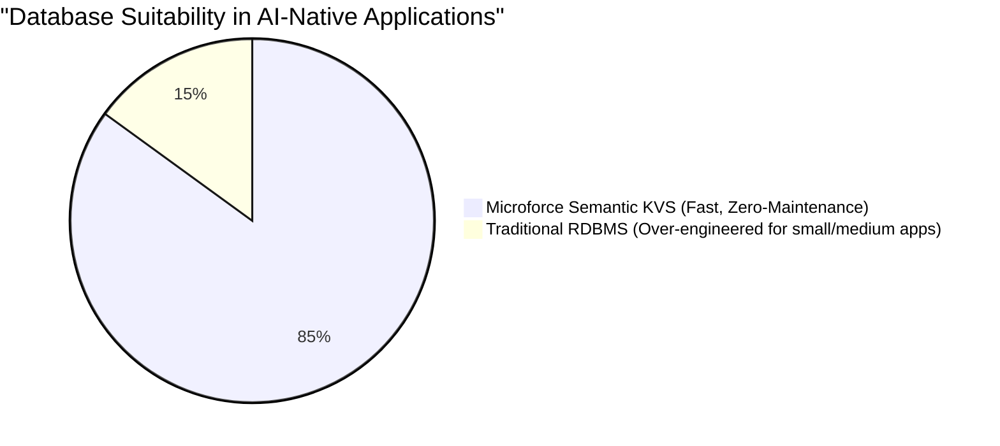

# Bypassing the RDBMS Bottleneck: A Semantic Key-Value Store Architecture for AI-Native Application Development

**Author:** Gen Nishizumi
**Project:** Microforce-Coer (V3)
**License:** Apache 2.0

---

## Abstract
For decades, Relational Database Management Systems (RDBMS) have dictated the architecture of software applications. The normalization of data into tabular schemas was driven by a fundamental constraint: human developers needed to visually comprehend data structures and write SQL to establish relationships. However, with the advent of Large Language Models (LLMs) serving as autonomous execution engines, this human-centric constraint has transformed into a critical bottleneck. This paper proposes the "Mille-feuille Architecture"—a multi-dimensional, Semantic Key-Value Store (KVS) that abandons SQL normalization in favor of vectorized, AI-native payload ingestion.

---

## 1. The RDBMS Bottleneck in the AI Era

In traditional system development, RDBMS have been indispensable. Data is decomposed up to the third normal form, foreign key constraints are established, and the data is mapped to application languages like Python or Go via ORM (Object-Relational Mapping). This process of "normalization" was a necessary ritual strictly designed to "organize data in a way that is easily comprehensible to the limited cognitive capacity of humans."

However, in the "AI-Native Era," where AI autonomously drives the system, this human-centric architecture creates fatal overhead.

AI does not require the process of reassembling fragmented tables using SQL. For an AI, the most efficient approach is to directly expand the necessary context (schema, data, UI constraints, etc.) into memory as a unified layer represented as a "multi-dimensional array" (JSON or Vector).

---

## 2. The Mille-feuille Architecture

The "Semantic KVS" we propose discards the complex array of RDB tables, purifying the structure into a single, massive Key-Value Store (KVS) table. We call this the **"Mille-feuille Architecture."**

### 2.1 Core Schema Design
On the storage engine (SQLite/PostgreSQL), there are practically only three columns:

1. **`layer_key` (Primary Key):** The unique ID that identifies the data aggregate (e.g., `catalog:summer_2026`).
2. **`layer_type` (Index):** A classification of what this layer represents (e.g., `schema`, `data`, `ui_rules`).
3. **`payload` (JSON):** The actual data body. It swallows Pandas 2D DataFrames or complex nested JSON structures entirely as-is.

### 2.2 Paradigm Shift in Data Handling
This architecture triggers the following revolutionary changes:

- **Eradication of Migrations:** Modifying the data structure (columns) is completed simply by adding JSON properties to the payload. Schema management tools like `ALTER TABLE` or Alembic become completely obsolete.
- **Bypassing the ORM:** By abolishing object mapping per row, the system transitions to a "vector-oriented" process that pours massive JSON payloads directly into Pydantic models or Pandas DataFrames in a single strike.

---

## 3. Disruption of the SME and SaaS Market

Naturally, PostgreSQL and Oracle will not immediately disappear from massive financial institutions performing petabyte-scale distributed transactions across thousands of servers.

However, in "SME business systems," "SaaS backends," and "internal management tools" — which account for over 90% of the world's applications — Semantic KVS emerges as the overwhelming optimal solution.

In these markets, traditional RDBMS is highly "over-engineered," needlessly inflating infrastructure maintenance costs. The "maintenance-free by AI," "local completion," and "ultra-fast KVS serialization" provided by Microforce-Coer represents a disruptive innovation capable of completely replacing this massive middle market.

---

## 4. Conclusion

"Database normalization" is now a relic of the past.
In the coming AI era, what is truly required is not "tables that are easy for human eyes to read," but rather "a stack of semantic layers that execution engines (AI) can process at maximum speed."

Microforce-Coer is a pioneering infrastructure that severs the chains of the past known as RDBMS, elevating software development to the next dimension.
